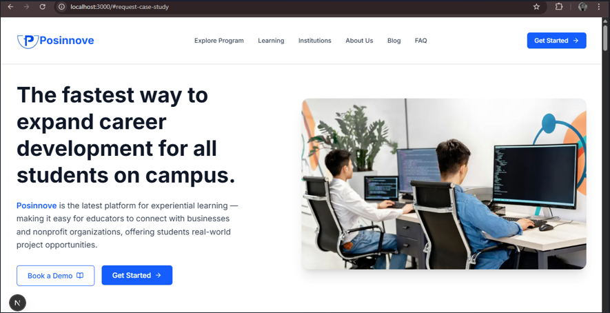
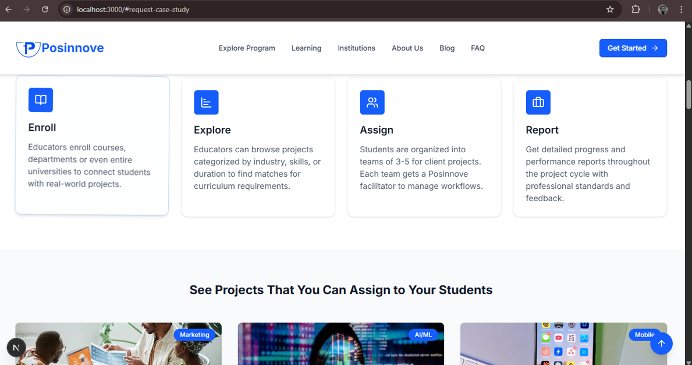
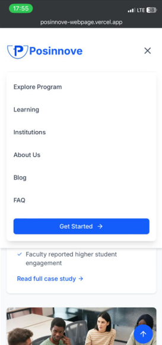

Posinnove Educational Institutions Page

This is a responsive, modern webpage built with Next.js, TypeScript, and Tailwind CSS. 
It was developed based on a Figma design provided by the Posinnove team and is intended 
to be part of their main platform site. The purpose of this project is to showcase 
partnerships with educational institutions and invite others to collaborate.

Project Objectives

- Develop a webpage that integrates smoothly into Posinnove’s main platform.
- Implement the layout based on the official Figma design.
- Create a clean, professional UI that is responsive and accessible.
- Gain real-world development experience by building a production-ready page.

Technologies Used

- Next.js (App Router + TypeScript)
- Tailwind CSS
- Framer Motion (for animations and transitions)
- Vercel (for deployment)

Key Features

- Institution Highlights – Logos and stories from academic collaborators.
- Visual Examples – Mockups, data, and metrics from successful projects.
- Call to Action – Buttons and links inviting institutions to join.
- Responsive Design – Works across all devices (desktop, tablet, mobile).
- Component-Based Structure – All sections split into individual reusable components.
- Scroll Navigation – Smooth section-to-section navigation using ID-based scrolling.
- Auto-Sliding Carousel – Project cards that cycle automatically with swipe support.
- Animated Transitions – Section fades and button interactions for a polished feel.

Folder Structure

src/
  ├── components/
  │   ├── Hero/
  │   ├── Partners/
  │   ├── Testimonials/
  │   ├── ...
  └── app/
      └── page.tsx

Setup Instructions

1. Clone the repository:
   git clone https://github.com/Montfort28/posinnove-webpage.git
   cd posinnove-webpage

2. Install dependencies:
   npm install

3. Run the development server:
   npm run dev

4. Open http://localhost:3000 in your browser.

Live Demo
Deployed project is available at: https://posinnove-webpage.vercel.app

Final Deliverables

- Fully responsive, production-ready webpage
- Clean code with reusable components
- Live deployment on Vercel
- This README with clear instructions

Final Notes

This project was developed as a standalone, production-ready webpage that follows the design and layout conventions of the official Posinnove platform. It is structured modularly so it can be easily integrated into the main Posinnove website as a new section or route. All animations, layout adjustments, and performance optimizations were tested thoroughly on both desktop and mobile environments. For navigational realism, external links such as Blogs and About Us point to the live Posinnove site (https://www.posinnove.com) to simulate actual user flow.

Screenshots
Homepage (Desktop View)

Projects Carousel

Mobile View

